# TERRAFORM

Repositorio de deficiones de despliegue en diversas plataformas Cloud haciendo uso de Terraform

---

## PREREQUISITOS

* Instalar Terraform CLI
* Instalar AWS CLI
* Cuenta en AWS o GCP

---

## APROVISIONAMIENTO AWS

Se llevara a cabo el aprovisionamiento de infrestructura en AWS con la creacion de una instancia basica de EC2, VPC y Bucket S3.

Este tutorial fue replicado de: [Build Infrastructure in AWS](https://learn.hashicorp.com/tutorials/terraform/aws-build)

1. Como primera instancia sera necesario contar con una cuenta de servicio donde el grupo asociado debera tener permisos de administracion y gestion de instancias EC2, creacion de VPC Y acceso full sobre objetos de S3.

2. Una vez tenemos el CLIENT_ID y el SECRET_ID del usuario del cual haremos uso el siguiente paso en configurar las credenciales del usuario con las variables de entorno respectivas con el fin de evitar tener esas claves seteadas en la definicion de **main.tf**.

3. Ingresar en consola **aws configure**

* AWS Access Key ID [****************OI4C]: DFDFDSFSDFSDFDWE
* AWS Secret Access Key [****************TTxS]: SDSDkndsoad51sdGSDK
* Default region name [VunW8KFB5gkLyBhSNbIMn/t+WXbV8ExflPsYpSefus-east-2]: us-east-1
* Default output format [None]: text

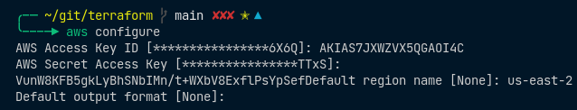

Este proceso almacena las claves en **~/.aws/credentials**

4. Procedemos a crear la **Configuracion Terraform** en un archivo denominado **main.tf**

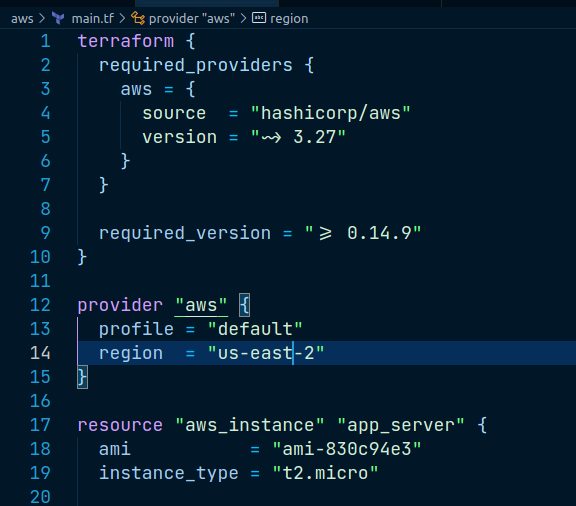

Como se observa en la **Configuracion Terraform** se definio lo siguiente:

* Definicion del Provider
* Creacion de una instancia **t2.micro**

Para consultar las AMI de las imagenes segun la region se pueden consultar en: [Find a Linux AMI](https://docs.aws.amazon.com/AWSEC2/latest/UserGuide/finding-an-ami.html#finding-quick-start-ami)

Para cada proveedor, el atributo define un nombre de host opcional, un espacio de nombres y el tipo de proveedor.

Terraform instala proveedores de la fuente de registro de terraform {} de forma predeterminada.

El bloque **Provider** configura el proveedor especificado, en este caso . Un proveedor es un plugin que Terraform utiliza para crear y administrar sus recursos **provider** **aws**

El bloque **Resources** define componentes de la infraestructura. Un recurso puede ser un componente físico o virtual, como una instancia EC2, o puede ser un recurso lógico como una aplicación Heroku.
Juntos, el tipo de recurso y el nombre de recurso forman un identificador único para el recurso. Por ejemplo, el ID de la instancia EC2 es **aws_instance** **app_server** **aws_instance** **aws** **aws_instance.app_server**

Los bloques de recursos contienen argumentos que se utilizan para configurar el recurso. Los argumentos pueden incluir cosas como tamaños de máquina, nombres de imágenes de disco o ID de VPC. nuestro [Referencia de Proveedores](https://www.terraform.io/docs/providers/index.html) documenta los argumentos obligatorios y opcionales para cada recurso. Para la instancia EC2, la configuración de ejemplo establece el ID de AMI en una imagen de Ubuntu y el tipo de instancia en , que califica para la capa gratuita de AWS. También establece una etiqueta para dar un nombre a la instancia.t2.micro

5. Despues de crear la **Configuracion terraform** se debera inicializar el directorio con **terraform init**

Ingresamos en Consola **cd ./aws && terraform init**

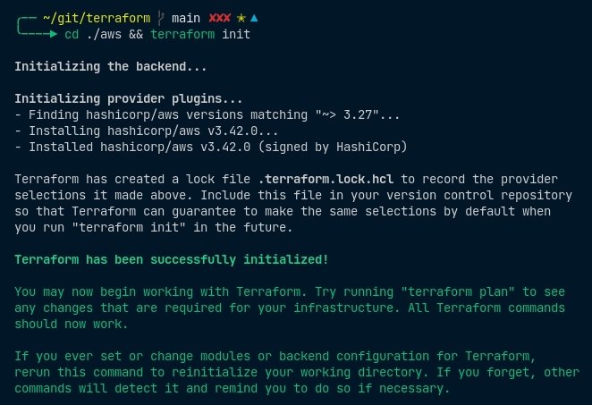

Terraform descarga el proveedor y lo instala en un subdirectorio oculto del directorio de trabajo actual.

6. Se recomienda usar un formato coherente en todos los archivos de configuración. Para esto hace,os uso de la funcionalidad **terraform fmt**

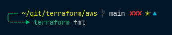

7. También puede asegurarse de que la configuración es sintácticamente válida e internamente coherente mediante el comando **terraform validate**

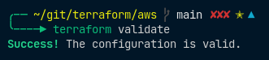

8. Validamos el plan de ejecucion con **terraform plan** donde se nos mostrara los recursos que se crearan antes de que se apliquen facticamente dicha definicion de creacion de infraestructura. 

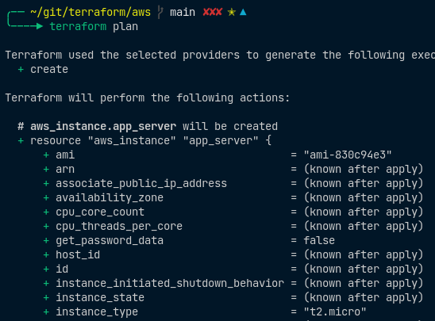

Aqui se observa que se creara un recurso

> Plan: 1 to add, 0 to change, 0 to destroy

9. Paso seguido procedemos a materializar la infraestructura en AWS. Para esto hacemos uso del comando **terraform apply**

Aqui se nos preguntara si realmente deseamos aplicar los cambios, para esto ingresamos en la consola **yes** 

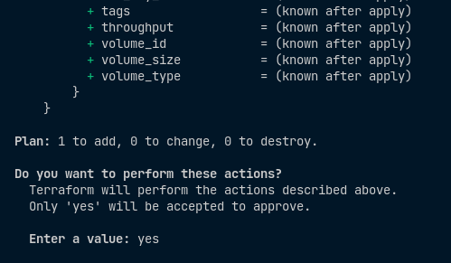

Si todo esta correcto tendremos la siguiente salida:

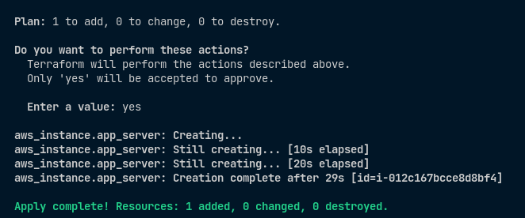

10. Vamos a la consola de administracion de AWS y validamos si la instancia fue creada exitosamente:

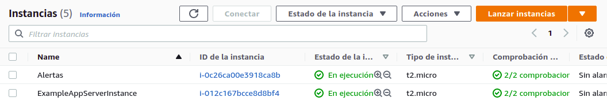

Como se observa la instancia **ExampleAppServerInstance** se creo exitosamente.

11. Por ultimo podremos destruir los recursos creados con: **terraform destroy**

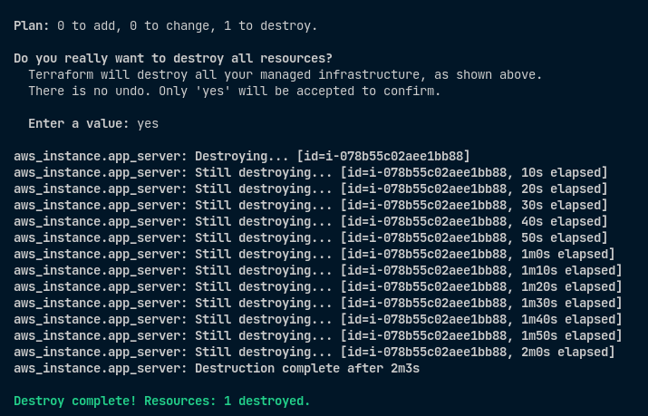

Si validamos en nuestra consola de AWS notaremos que ya fue destruida la instancia

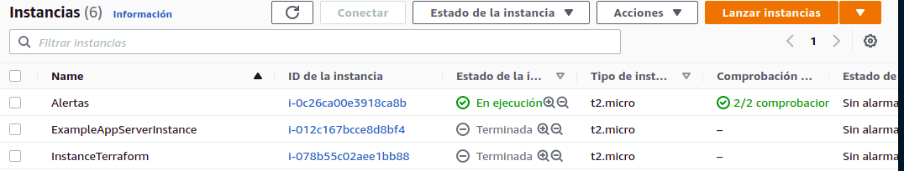

## CREACION DE INSTANCIA EC2 CON AWS-CLI

>> aws ec2 run-instances --image-id ami-00eb20669e0990cb4 --count 1 --instance-type t2.micro